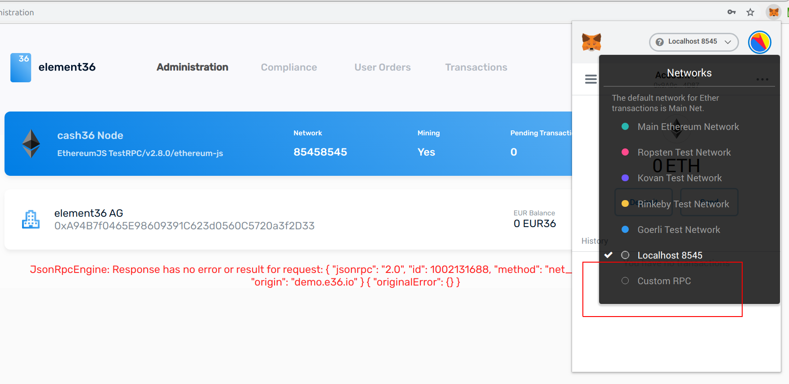
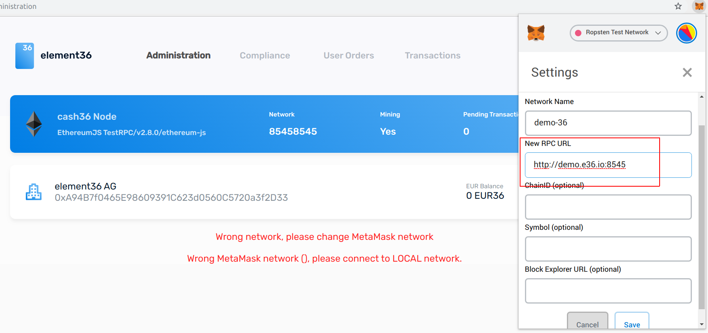

# Using the compliance desk
You can test the compliance desk in the demo environment.  You can: 

- Manage KYC attestations - in the database as well as on the smart contract level
- Control fees

You need to have Metamask installed and  to log in. P
In production the Metamask-ID needs to be registered in order to work with the 
compliance desk.  

## Loggin in

- Activate Metamask
- Passwort for demo is: admin/password.

You should see following error message, because you are on the wrong network with Metamask:

## Adding correct demo network

You need to add http://demo.e36.io:8545 network to Metamask: 

If successful, you should see following: 

