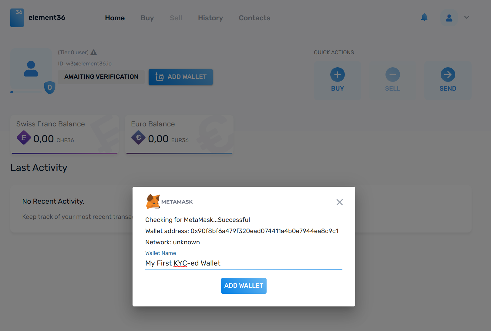
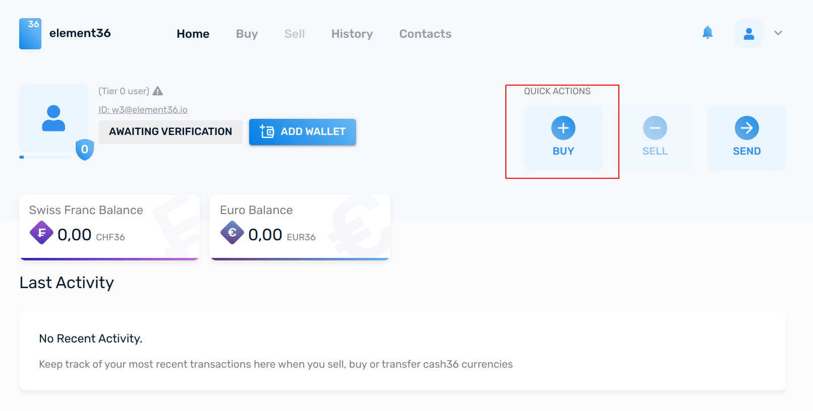
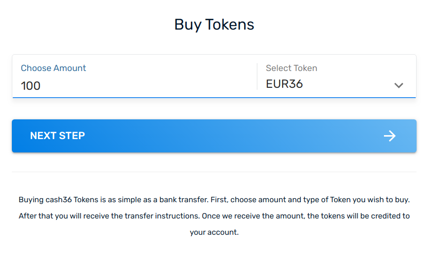
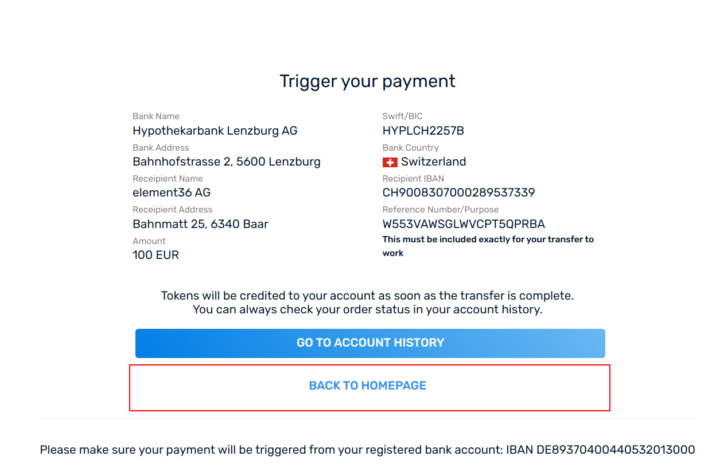

# Manual buy of EUR36/CHF on the demo system

Loading a wallet with EUR36 or CHF36 on the dev or demo system can be done via API or via the UI. 
Do following steps to load a wallet: 

- Fully Register yourself
- Have a metamask and an account ready. 
- Use BUY with the amount you want, and then use "manual transfer". 

## Check status
To check if MetaMask (or uPort) is active, check if the BUY fuction is ready or not - here it is still deactivated:  

## Activate MetaMask

## Add the (MetaMask) wallet

## Buy the tokens

Set the amount: 

Select the "manual" choice:

Done: 

Check result - update may take a bit because of blockchain: 
