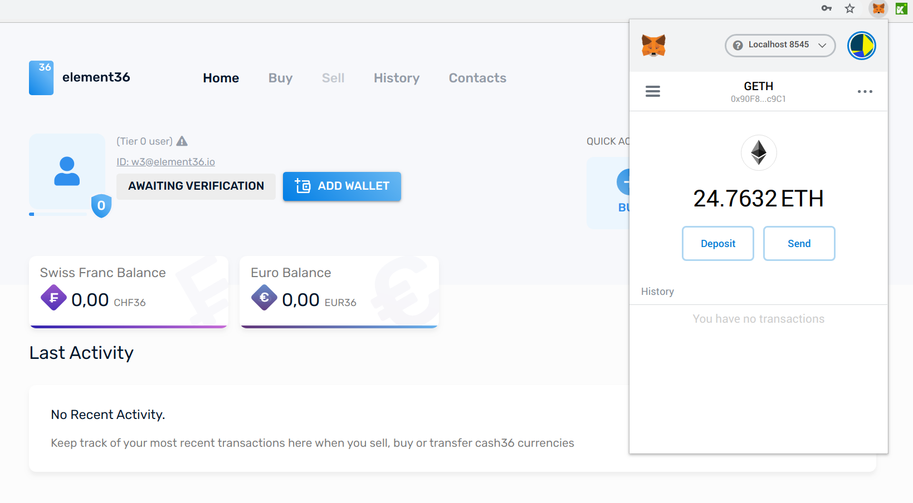

# Upload user-data API documentation

Submit compliance data for a customer. This API can be used by KYC-ed entities of 
element36. The data need to be prepared accordig to Swiss Laws enforced by [Finma](finma.ch), 
who enforces  international ruling of [FATF](fatf.org). Element36 AG is 
supervised by [VQF](vqf.ch) who is auditing element36 AG. VQF is autited by finma. 

[TOC](./src/toc.md) or [single page version](./src/singlepage.md)

A demo server is currently set up at: 
- [Demo Exchange](http://demo.e36.io:3000) - click "Sign up". You may use "demo@element36.io" 
and "\_\_E36.io\_\_" for a quick test. The server will be reset daily, and it is not guaranteed that
the demo-user is around. You may register your own user anytime - enter arbitrary data for onboarding, 
as IBAN use any valid number like "DE89 3704 0044 0532 0130 00"
- [Demo Swagger UI](http://demo.e36.io:8090/swagger-ui.html#/user-api-controler) - select the proper API (cash36-compliance) 
at the dropdown on top-right, and look for "user-api-controler". Try to login with your created identity. 
- [Demo Compliance Desk](http://demo.e36.io:3001/) - Look [here](./src/admin-login.md) how to login. 

For a quick sneak, you may do following: 
- Log in with demo@element36 (or create your own user if demo-user  is not set up)
- Connect your Wallet to our demo-blockchain/RPC: demo.e36.io:8545 and add your Metamask-Wallet using the UI
- Buy EUR/CHF

For more information, visit [element36 AG](https://element36.io). 

# Table of contents

Go to the [single page version](singlepage.md), or jump to the chapters: 

- [Swagger Basics](swagger.md)
- [Submit Customer Data](submitCustomerData.md)
- [Simulate SEPA/bank transfer via UI](manual-buy.md)
- [Use the compliance desk](admin-login.md)

# Using and authenticating in Swagger
We provide Swagger https://swagger.io/ on our demo and testplatforms as development environment.  

See Swagger for demo URL: 
- http://demo.e36.io:3000/swagger-ui.html

Almost all URL are protected - but you can access them by creating your own 
element36 account, or
by using the loin and password demo@element36.io/Element36_io 

# Authentication

Use any "lock" symbol on the method level to authenticate. You only have to do this once: 

Use your login/password what you have created or the demo user: 

Test your setup by selecting "cash36-compliance": 

Look for user-controller and try "/current-user". As you are already loogged in, it
shows data of your own user: 

# Submit customer KYC data

- You need to have a validated account at element36.io. 
- Authenticate with your existing element36 user in Swagger or on your client-side using OAuth. 
- Check model for possible enum values. For submitting countries use international codes like AT for 
Austria or CH for Switzerland. The "data-controler" service gives access to possible values according
to FATF rules. 

## API Overview :

Select cash36-compliance on http://demo.element36.io:8090/swagger-ui-html: 

Scroll down to user-api-controller and unfold. You should see this:

## Creating a new customer data set

Call `/api-v1/user/*` methods in the following order: 

- `/create-user`: Create a user (a customer) on the element36 platform. The 
Email will be used as ID throughout the API.  
- `/step-1`: Submit personal data.  
- `/step-2`: Important and explicit step to confirm beneficial ownership. This means, 
that the investor is really the one who is controlling the funds. If the user 
is not the actual owner (or beneficial owner) of the funds, this is currently not 
supported by the API. E.g. if an assistant does the onboarding for somebody else, 
then this would be a case which is not supported. 
- `/get-step-3-code/{userEmail}`: We need a "liveness" test. A user need to 
take a selfie, which contains a random word written on a paper. The photo
need to show face and the word on the same picture. The picture needs to 
be matched with the identity or passport documents.  
- `/step-3`: Submit documents and images of identities. Passport or identity, 
including a selfie-picture with the code of the previous step.
- `/step-4`: Answer questions of occupation, source of funds etc. 

The user can only be fully onboarded, if we also receive a bank transaction, 
which matches the data given in step-1.  
The bank information must be given in step-1. If KYC process is positive
and also bank transaction matches the data, then the user is KYC-ed, and
his funds are converted to EUR36 or CHF36. 

## Quick Test

To test your setup, 
try to create external user: 
http://demo.element36.io:8090/swagger-ui.html#/user-api-controler/createUserUsingPOST

## Additional functions for development

- `/dev/authenticate/{userEmail}`: What usualy is done by the compliance officers of element36, 
you can to for yourself on our development and demo servers. Call this function after
completing /step-4. This will validate the KYC data of the customer. 

- `/get-info/{userEmail}`: Get the onboarding status of a user. It contains two status fields.  
The `currentLevel` contains the actual status in terms of anti-money-laundering. Tier_0 means, 
that basically 
nothing can be done. After /step-1 the user is in the state Tier_1, where we accept
funds from a user and bank account, but do not actually mint EUR36 or CHF36. We hold the 
funds until the KYC process is completed or cancelled. The KYC process checks the meta 
data of a bank-transaction, which should be obviously linked to the customer - we compare  
the bank account's name with the name of the customer or beneficial owner. If the KYC
process cannot be completed in several days, then the funds are send back to the customer. 
`currentProcessStatus` gives insight how the KYC process evolves. The status `CLOSED` means, 
that there are no open issues, and "currentLevel" is a final decision. 
 

- `/dev/send-tokens-to`: In a development environment, you may simulate bank transactions of
your clients. If your client is successfully onboarded and also authenticated
(using `/dev/authenticate/{userEmail}` you may send funds to the wallet of your client. 
The system takes the `userEmail`, determines the wallet, address and sends EUR36 or CHF36
to the wallet. 

- The API uses `enums` which helps to use correct parameter values. Click on "model" of the API
to see to check for valid strings:

 

 

# Manual buy of EUR36/CHF on the demo system

Loading a wallet with EUR36 or CHF36 on the dev or demo system can be done via API or via the UI. 
Do following steps to load a wallet: 

- Fully Register yourself
- Have a metamask and an account ready. 
- Use BUY with the amount you want, and then use "manual transfer". 

## Check status
To check if MetaMask (or uPort) is active, check if the BUY fuction is ready or not - here it is still deactivated:  

## Activate MetaMask

## Add the (MetaMask) wallet

## Buy the tokens

Set the amount: 

Select the "manual" choice:

Done: 

Check result - update may take a bit because of blockchain: 
# Using the compliance desk
You can test the compliance desk in the demo environment.  You can: 

- Manage KYC attestations - in the database as well as on the smart contract level
- Control fees

You need to have Metamask installed and  to log in. P
In production the Metamask-ID needs to be registered in order to work with the 
compliance desk.  

## Loggin in

- Activate Metamask
- Passwort for demo is: admin/password.

You should see following error message, because you are on the wrong network with Metamask:

## Adding correct demo network

You need to add http://demo.e36.io:8545 network to Metamask: 

If successful, you should see following: 

