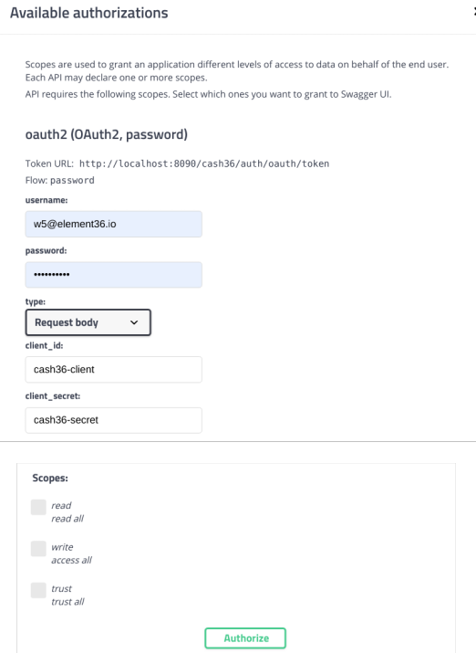
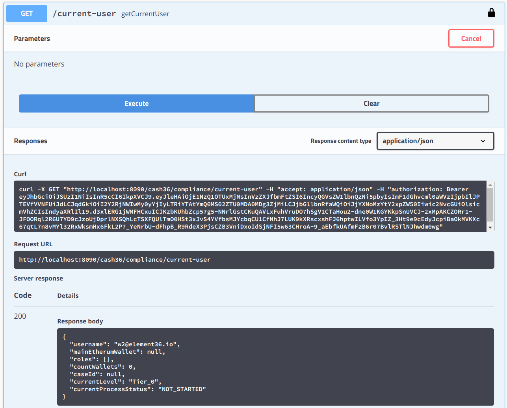

# Using and authenticating in Swagger
We provide Swagger https://swagger.io/ on our demo and testplatforms as development environment.  

See Swagger for demo URL: 
- http://demo.e36.io:3000/swagger-ui.html

Almost all URL are protected - but you can access them by creating your own 
element36 account, or
by using the loin and password demo@element36.io/Element36_io 

# Authentication

Use any "lock" symbol on the method level to authenticate. You only have to do this once: 

Use your login/password what you have created or the demo user: 

Test your setup by selecting "cash36-compliance": 

Look for user-controller and try "/current-user". As you are already loogged in, it
shows data of your own user: 

